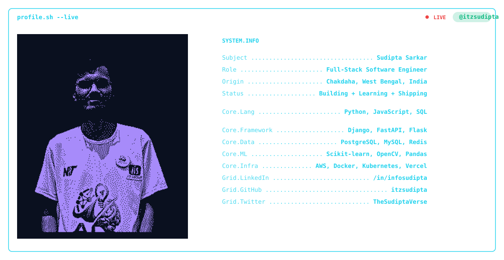

  <!-- PHASE 1: Banner -->
  <picture>
    <source media="(prefers-color-scheme: dark)" srcset="dark.svg">
    <source media="(prefers-color-scheme: light)" srcset="light.svg">
    
  </picture>

    

  <!-- PHASE 4: Social Badges -->
  &nbsp;&nbsp;
  &nbsp;&nbsp;
  

    

  <!-- PHASE 2: Stats Cards -->
  <picture>
    
  </picture>

   

  
  

    

  <!-- PHASE 3: Contribution Snake -->
  <picture>
    <source media="(prefers-color-scheme: dark)" srcset="https://raw.githubusercontent.com/itzsudipta/itzsudipta/output/dist/github-snake-dark.svg">
    <source media="(prefers-color-scheme: light)" srcset="https://raw.githubusercontent.com/itzsudipta/itzsudipta/output/dist/github-snake-light.svg">
    
  </picture>

