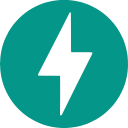
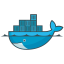

<!-- ===== BANNER (Manual — fixed size) =====
<!-- Recommended banner asset size: 1200 x 300 px (4:1 ratio). Replace SRC below with your banner image URL. -->
<!-- 

  

  -->
<!-- ===== END BANNER ===== -->

<!-- ===== WHO I AM ===== -->

## Who I Am

A  Computer Science Engineer from Narula Institute of Technology Kolkata, with a strong interest in software development, scalable web applications, and academic research. I mainly work with Python to build practical and efficient backend systems, along with simple and clean frontend technologies to create complete web applications. I enjoy designing applications that are easy to maintain, scalable, and reliable, and I am also interested in deploying and managing these applications on AWS.

Alongside software development, I have a strong interest in academic research and journal publications, with a primary focus on Computer Vision and Deep Learning. I enjoy exploring emerging AI techniques, working with datasets, experimenting with machine learning and deep learning models, and understanding how research concepts can be transformed into practical solutions.I have also conducted research on Diffusion Models and explored their applications in Fashion Engineering and AI-driven fashion design.
 
<!-- ===== RESEARCH & PUBLICATION ===== -->
## Research & Publication

**Published Research Paper**
A study on Retrieval-Augmented Generation (RAG) combined with diffusion models, co-authored with Prof. Ritwika Mukherjee, Assistant Professor , NiT Kolkata.
[IEEE (DOI: 10.1109/ICC-CNS70518.2026.11606144)](https://doi.org/10.1109/ICC-CNS70518.2026.11606144)

**Patent 1 — Co-Inventor, Published Application**
Ai-driven victim detection using tof sensor data in multi-sensor uavs.
<!-- [View Patent](PATENT_1_LINK_HERE) -->

**Patent 2 — Co-Inventor, Published Application**
UAVs integrated with ai accelerator for real-time delay tolerant intelligence system in
disaster management.
<!-- **[For More, Visit My Portfolio →](PORTFOLIO_LINK_HERE)** -->

<!-- ===== TECH STACK (Manual icons — fixed size) ===== -->
## My Tech Stack
<!-- Table grid: one row per category, category label in the first column, icons aligned in the rest. -->
<!-- Replace each src="ICON_URL_HERE" with your own icon file/URL. Icon size fixed at 32x32. -->

&nbsp;&nbsp;&nbsp;&nbsp;&nbsp;&nbsp;&nbsp;&nbsp;&nbsp;&nbsp;&nbsp;&nbsp;&nbsp;&nbsp;&nbsp;&nbsp;&nbsp;&nbsp;&nbsp;&nbsp;&nbsp;&nbsp;&nbsp;&nbsp;&nbsp;&nbsp;&nbsp;&nbsp;&nbsp;&nbsp;&nbsp;&nbsp;

<!-- ===== CONTRIBUTION SNAKE ===== -->
## Contributions

<!-- Snake SVG rendered at full width, fixed height ~200px for consistency -->

  <picture>
    <source media="(prefers-color-scheme: dark)" srcset="https://raw.githubusercontent.com/itzsudipta/itzsudipta/output/snake-dark.svg" />
    <source media="(prefers-color-scheme: light)" srcset="https://raw.githubusercontent.com/itzsudipta/itzsudipta/output/snake-light.svg" />
    
  </picture>

 

<!-- ===== CONTACT ===== -->
## Connect

&nbsp;&nbsp;

&nbsp;&nbsp;
<!--  -->

